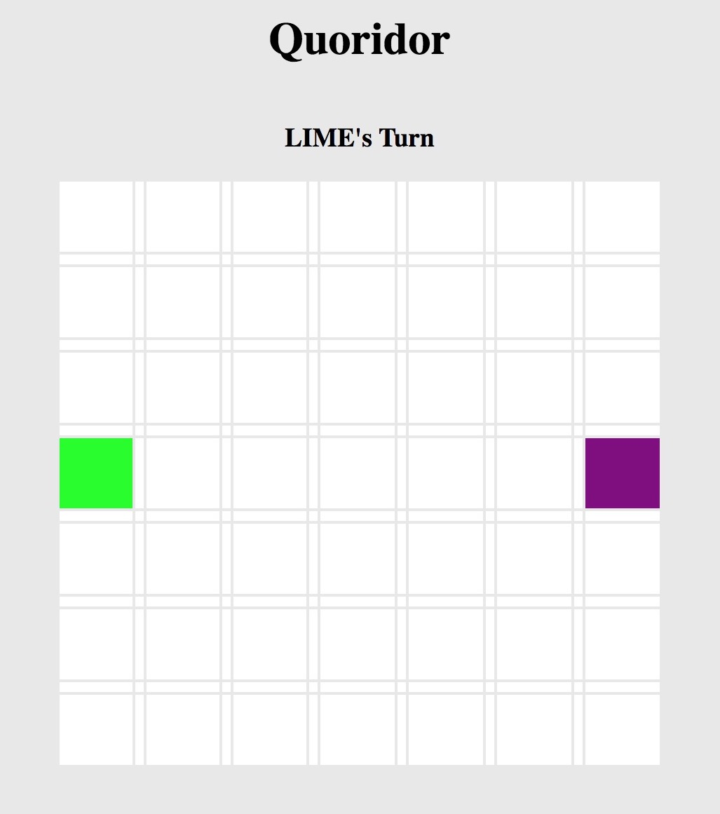

# Quoridoor (Unit One Project)

## What Is Quoridor
Quoridoor is a turn based, two player game. The objective is to get to the other side of the map before the other player does. Each turn players can choose to either move one square in a cardinal direction or to put a wall down on the side of a tile. 

The controls are very simple. The game will note whose turn it is, and that player will be able to move by clicking adjacent squares, or place a wall by clicking on one of the thing "border" squares located anywhere on the map.

There are two main differences between this implementation of Quoridor and the traditional one. In traditional Quoridoor, the walls are two squares long, whereas in this the walls are one square long. Also in traditional Quoridoor you cannot place a wall in a place that would totally prevent your opponent from being able to win the game. I was unable to assemble an algorithm capable of detecting whether a given wall would create a total lock, which means that rule is not implemented. However, given the lack of two length walls, it is likely less necessary.

Once a player reaches the victory condition, the game announces their victory and displays a restart button. Clicking this button reinitializes the game.

##Technologies Used
This project was built with HTML, CSS, and a healthy amount of vanilla Javascript. 

##I Want To Play This!
This game is hosted [on GitHub Pages](http://rudysummers.com/Quoridoor/) and can be played any time. There is no AI implemented (yet) so you'll need a friend to play. The game description above also contains control instructions if it isn't immediately intuitive how to play.

##Future Plans
Some icebox items I'm hoping to get to when I have the time to expand this game:

* Play against AI mode
* Logic that prevents players from creating unwinnable gamestates.
* Alternative controls (move using arrow keys)
* Proper icons for players that aren't boxes of colors.